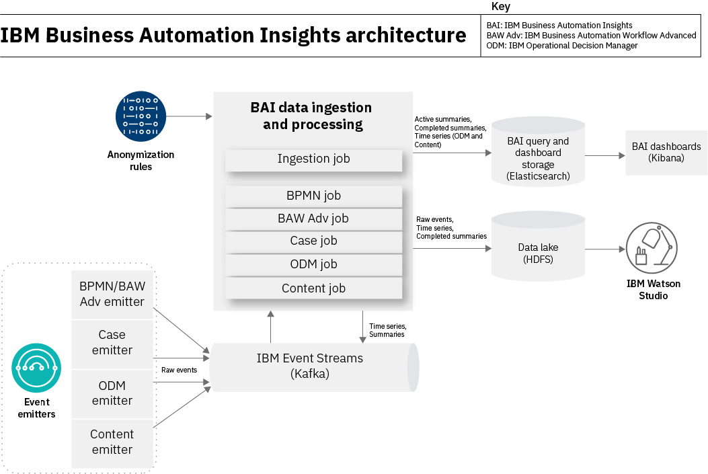

# Installing IBM Business Automation Insights on Certified Kubernetes


> **NOTE**: This procedure covers the deployment on certified Kubernetes. To deploy on IBM Cloud Private 3.1.2, see [Getting started with IBM Business Automation Insights](https://www.ibm.com/support/knowledgecenter/en/SSYHZ8_19.0.x/com.ibm.dba.bai/topics/tut_getting_started.html).

## Overview

IBM Business Automation Insights is a platform-level component that provides visualization insights to business owners and feeds a data lake to infuse artificial intelligence into IBM Digital Business Automation.

Based on state-of-the-art open source technologies, IBM Business Automation Insights captures all events that are generated by the operational systems implemented with the Digital Business Automation products, aggregates these events into business-relevant KPIs, and presents them in meaningful dashboards for lines of business to have a real-time view on their business operations.

### Entities

IBM Business Automation Insights processes and produces the following entities:

- Raw events: Native events that are ingested and processed by IBM Business Automation Insights.

- Time series: Simplified, flattened versions of raw events.

- Summaries: Aggregations of time series. For example, each process instance, activity instance, or case instance has a summary entity. Summaries describe the current state of the process, activity, or case instance, and compute their duration. Summaries are complete when the process, activity, or case is completed.

### Architecture diagram



### Deployed artifacts

When you install IBM Business Automation Insights, the following main elements are deployed:

- A `bai-admin` pod in charge of the IBM Business Automation Insights REST API.
- An Apache Flink cluster (`bai-jobmanager` and `bai-taskmanager`) hosting the IBM Business Automation Insights event processing.
- Optionally, an Elasticsearch and Kibana cluster to gather data from the event processing.

If you want to use an HDFS data lake, you must install it separately.

## Requirements

### Kubernetes cluster

IBM Business Automation Insights requires a certified Kubernetes platform
(see [support statement](../README.md#support-statement)).

### Helm command line interface

To install Helm, follow these [instructions](https://docs.helm.sh/using_helm/#installing-helm).

### Apache Kafka

An Apache Kafka cluster must be up and running before you deploy IBM Business Automation Insights.
The Apache Kafka connection must be configured in the Helm Chart values.

For a quick start, try [Confluent Apache Kafka Helm Chart](https://github.com/confluentinc/cp-helm-charts).

To enable secure communications with Confluent Kafka by using the SASL security protocol, you must modify the values.yaml file of this chart.

```yaml
kafka:
  username: "kafka"
  password: "kafka-password"
  bootstrapServers: "kafka_ip_or_hostname:port"
  securityProtocol: "SASL_SSL"
  serverCertificate: "<base64-encoded CA certificate>"
```

Define the username and password supplied in `kafka.username` and `kafka.password` on the Kafka server side in appropriate JAAS configuration files, such as `kafka_jaas.conf` and `zookeeper_jaas.conf`. 

- `kafka_jaas.conf`

```
KafkaServer {
   org.apache.kafka.common.security.plain.PlainLoginModule required
   username="kafka"
   password="kafka-password"
   user_kafka="kafka-password";
};

Client {
   org.apache.zookeeper.server.auth.DigestLoginModule required
   username="admin"
   password="admin-secret";
};
```

- `zookeeper_jaas.conf`

```
Server {
   org.apache.zookeeper.server.auth.DigestLoginModule required
   user_super="admin-secret"
   user_admin="admin-secret";
};
```

To use a JAAS configuration and the SASL protocol, pass the following system properties to the Kafka and Zookeeper JVMs.

```
-Djava.security.auth.login.config=<absolute path to Kafka JAAS file>
-Djava.security.auth.login.config=<absolute path to Zookeeper JAAS file>
-Dzookeeper.authProvider.1=org.apache.zookeeper.server.auth.SASLAuthenticationProvider 
-Dzookeeper.requireClientAuthScheme=sasl
```
To do so, you can set the `KAFKA_OPTS` environment variable and assign it a string that contains these properties.

To ensure SSL encryption between the Kafka client and the Kafka brokers, the kafka.serverCertificate parameter must contain the base64-encoded CA certificate that is used to sign each certificate of the Kafka brokers. 


## Before you begin

### Connect to the cluster

1. Log in to your Kubernetes cluster.

   For example, on OpenShift:
   ```
   oc login https://<CLUSTER_IP>:8443
   ```

2. Create a namespace where to deploy IBM Business Automation Insights:

   ```sh
   kubectl create namespace <NAMESPACE>
   ```

### Upload the images

You need to upload the IBM Business Automation Insights images to the docker registry of the Kubernetes cluster. See: [Download a product package from PPA and load the images](../README.md#download-ppa-and-load-images).

### Configure the storage

IBM Business Automation Insights requires a certain number of persistent volumes.

Apache Flink needs a persistent volume to store its internal state and to support fault tolerance and high availability.

Choose between dynamic provisioning or creating the persistent volumes manually.

#### Dynamic provisioning

If you use dynamic provisioning, make sure to use a `StorageClass` with a `reclaimPolicy` set to `Retain`. Otherwise, you might lose your data when
you upgrade or update IBM Business Automation Insights because a different persistent volume might be allocated.

Unless you intend to use the default `StorageClass` of your Kubernetes environment, you must set the following configuration properties with the `StorageClass` name to use: `flinkPv.storageClassName`, `ibm-dba-ek.data.storage.storageClass`, and `ibm-dba-ek.elasticsearch.data.snapshotStorage.storageClassName`.

You then need to set `persistence.useDynamicProvisioning`,`ibm-dba-ek.elasticsearch.data.storage.useDynamicProvisioning`, and `ibm-dba-ek.elasticsearch.data.snapshotStorage.useDynamicProvisioning` to `true` when you deploy IBM Business Automation Insights.

`ibm-dba-ek` settings are required only if you install embedded Elasticsearch.

#### Manual provisioning

In the current section, `<NFS_SHARED_PATH>` is a path that is NFS-shared by the NFS server with IP equal to `<NFS_SERVER_IP>`.
You must ensure that your Kubernetes nodes have a very fast access to the NFS shared folders.
Usually, the NFS share is set up on the master node of your Kubernetes cluster, thus `<NFS_SERVER_IP>` equals `<CLUSTER_IP>`.

If dynamic provisioning is not enabled on the Kubernetes cluster or if you prefer to control the provisioning, you must create persistent volumes from scratch.

1. Create a persistent volume for Apache Flink.

   It is recommended to apply the `Retain` reclaim policy to make sure that data is not lost when you install a new release of IBM Business Automation Insights.
Use the following YAML file to create a persistent volume. Replace the placeholders with the values that are appropriate for your environment.

```yaml
apiVersion: v1
kind: PersistentVolume
metadata:
  name: ibm-bai-pv
spec:
  accessModes:
  - ReadWriteMany
  capacity:
    storage: <STORAGE_CAPACITY>
  nfs:
    path: <NFS_SHARED_PATH>/ibm-bai-pv
    server: <NFS_SERVER_IP>
  persistentVolumeReclaimPolicy: Retain
  claimRef:
    namespace: <NAMESPACE>
    name: <FLINK_PVC_NAME>
```

> **Note**: The `claimRef` section is optional. However, you must set it in a production environment if you want to make sure that your release always uses the same volume and if you do not want to lose your data. If you add the `claimRef` section, you must also set the namespace and the name of the persistent volume claim, as in step 2.

2. *Optional*: Create a persistent volume claim for Apache Flink.

   Use the following YAML file to create a persistent volume claim. Replace the placeholders with the appropriate values.
The value of `<FLINK_PVC_NAME>` must match the name provided in the `claimRef` section of the persistent volume.
The `<STORAGE_SIZE>` value must be smaller than or equal to the value of the persistent volume storage capacity.
The persistent volume claim must provide enough space to fit the capacity set at installation time. The default capacity is `20Gi`.

```yaml
kind: PersistentVolumeClaim
apiVersion: v1
metadata:
  name: <FLINK_PVC_NAME>
  namespace: <NAMESPACE>
spec:
  storageClassName: ""
  accessModes:
    - ReadWriteMany
  resources:
    requests:
      storage: <STORAGE_SIZE>
```

3. If you use embedded Elasticsearch, deployed together with IBM Business Automation Insights, rather than your own Elasticsearch, create the persistent volumes for Elasticsearch.

   It is recommended to apply the `Retain` reclaim policy to make sure that data is not lost when you install a new release of IBM Business Automation Insights.
The following YAML creates persistent volumes and sets the reclaim policy for two data nodes and a master node.

```yaml
apiVersion: v1
kind: PersistentVolume
metadata:
  name: ibm-bai-ek-pv-0
spec:
  accessModes:
  - ReadWriteOnce
  capacity:
    storage: 10Gi
  nfs:
    path: <NFS_SHARED_PATH>/ibm-bai-ek-pv-0
    server: <NFS_SERVER_IP>
  persistentVolumeReclaimPolicy: Retain
---
apiVersion: v1
kind: PersistentVolume
metadata:
  name: ibm-bai-ek-pv-1
spec:
  accessModes:
  - ReadWriteOnce
  capacity:
    storage: 10Gi
  nfs:
    path: <NFS_SHARED_PATH>/ibm-bai-ek-pv-1
    server: <NFS_SERVER_IP>
  persistentVolumeReclaimPolicy: Retain
---
apiVersion: v1
kind: PersistentVolume
metadata:
  name: ibm-bai-ek-pv-2
spec:
  accessModes:
  - ReadWriteOnce
  capacity:
    storage: 10Gi
  nfs:
    path: <NFS_SHARED_PATH>/ibm-bai-ek-pv-2
    server: <NFS_SERVER_IP>
  persistentVolumeReclaimPolicy: Retain
```

4. *Optional*: If you want to refine the binding of the persistent volumes, provide a `storageClassName` value in the persistent volume .yaml file and then reference it when you configure the IBM Business Automation Insights installation.

   Modify the sample [pv.yaml](./configuration/pv.yaml) and deploy it as follows:

   ```sh
   kubectl apply -f pv.yaml
   ```

#### Persistent volume access rights

The access rights to the persistent volumes are as follows:
- user `9999` and group `9999` must have read and write access to the Apache Flink persistent volume.

- user `1000` and group `1000` must have read and write access to the Elasticsearch persistent volumes.

### Configure the image policy

- If you use the Docker registry of the Kubernetes cluster, the default image policy, `default-dockercfg-*`, is applied. Check it out by running the following command: 
```sh
kubectl get secrets -n <NAMESPACE> | grep kubernetes.io/dockercfg
```

- If you use a Docker registry that is external to the Kubernetes cluster, you must define an image policy to be able to access the Docker registry:

```sh
kubectl create secret docker-registry <REGISTRY_NAME> --docker-server=<REGISTRY_URL> --docker-username=<DOCKER_USER> --docker-password=<DOCKER_PWD> --docker-email=<DOCKER_USER_EMAIL> -n <NAMESPACE>
```

## PodSecurityPolicy Requirements

Before installation, this chart requires a PodSecurityPolicy resource to be bound to the target namespace.
The predefined PodSecurityPolicy resource named [`ibm-anyuid-psp`](https://ibm.biz/cpkspec-psp) has been verified for this chart.

You must also set up the proper PodSecurityPolicy, Role, ServiceAccount, and RoleBinding Kubernetes resources to allow
the pods to run privileged containers. To achieve this, you must set up a custom PodSecurityPolicy definition.

1- Adapt the following YAML content to reference your Kubernetes namespace and Business Automation Insights Helm release name, and save it to a file named `bai-psp.yml`, which sets up the Custom PodSecurityPolicy definition.
```yaml
apiVersion: policy/v1beta1
kind: PodSecurityPolicy
metadata:
  annotations:
    kubernetes.io/description: "This policy is required to allow ibm-dba-ek pods running Elasticsearch to use privileged containers."
  name: <RELEASE_NAME>-bai-psp
spec:
  privileged: true
  runAsUser:
    rule: RunAsAny
  seLinux:
    rule: RunAsAny
  supplementalGroups:
    rule: RunAsAny
  fsGroup:
    rule: RunAsAny
  volumes:
  - '*'
---
apiVersion: rbac.authorization.k8s.io/v1
kind: Role
metadata:
  name: <RELEASE_NAME>-bai-role
  namespace: <NAMESPACE>
rules:
- apiGroups:
  - extensions
  resourceNames:
  - <RELEASE_NAME>-bai-psp
  resources:
  - podsecuritypolicies
  verbs:
  - use
---
apiVersion: v1
kind: ServiceAccount
metadata:
  name: <RELEASE_NAME>-bai-psp-sa  
---
apiVersion: rbac.authorization.k8s.io/v1
kind: RoleBinding
metadata:
  name: <RELEASE_NAME>-bai-rolebinding
  namespace: <NAMESPACE>
roleRef:
  apiGroup: rbac.authorization.k8s.io
  kind: Role
  name: <RELEASE_NAME>-bai-role
subjects:
- kind: ServiceAccount
  name: <RELEASE_NAME>-bai-psp-sa
  namespace: <NAMESPACE>
```
2- Execute:
```bash
kubectl create -f bai-psp.yaml -n <NAMESPACE>
```

This command allows the pods to run the sysctl commands that are needed at initialization.


## Red Hat OpenShift SecurityContextConstraints Requirements

If you are installing the chart on Red Hat OpenShift or OKD, the [ibm-anyuid-scc](https://ibm.biz/cpkscc-spec) SecurityContextConstraint is required to install the chart. 

If you are planning to install Elasticsearch and Kibana as part of IBM Business Automation Insights on Red Hat OpenShift or OKD, you must also create a service account that has the [ibm-privileged-scc](https://ibm.biz/cpkscc-spec) SecurityContextConstraint to allow running privileged containers:
```
$ oc create serviceaccount <RELEASE_NAME>-bai-psp-sa
$ oc adm policy add-scc-to-user ibm-privileged-scc -z <RELEASE_NAME>-bai-psp-sa
```

If you cannot or do not want to allow running privileged containers, you can still install IBM Business Automation Insights but you must configure it to use an external Elasticsearch (in Helm values, set `elasticsearch.install: false`).

## Installing

There are two ways to deploy IBM Business Automation Insights to the Kubernetes cluster:

### Install IBM Business Automation Insights by using the Helm chart and Tiller

Refer to [Helm instructions](./helm-charts/README.md).

### Install IBM Business Automation Insights by using Kubernetes YAML

Refer to [Kubernetes instructions](./k8s-yaml/README.md).

## Post-installation steps

IBM Business Automation Insights is correctly deployed when all the jobs are completed, all the pods are running and ready, and all the services are reachable.

- Monitor the status of the jobs and check that all of them are marked as successful by executing  the following command:
 ```sh
kubectl get jobs -n <NAMESPACE>
```
- Monitor the status of the pods and check that all of them are in `Running` mode and with all their containers `Ready` (for example, 2/2) by executing the following command:
 ```sh
kubectl get pods -n <NAMESPACE>
```
- Verify that all the services are reachable by accessing the corresponding URLs. 
When all the services have the default value for `serviceType`, that is, NodePort, the URLs are as follows:
 ```sh
export NODE_IP=$(kubectl cluster-info | grep "master" | awk 'match($0, /([0-9]{1,3}\.){3}[0-9]{1,3}/) { print substr( $0, RSTART, RLENGTH )}')
export ADMIN_NODE_PORT=$(kubectl get svc -n <NAMESPACE> "bai-bai-admin-service" -o 'jsonpath={.spec.ports[?(@.targetPort=="admin-rest")].nodePort}')
export ES_NODE_PORT=$(kubectl get svc -n <NAMESPACE> "bai-ibm-dba-ek-client" -o 'jsonpath={.spec.ports[?(@.targetPort=="es-rest")].nodePort}')
export KIBANA_NODE_PORT=$(kubectl get svc -n <NAMESPACE> "bai-ibm-dba-ek-kibana" -o 'jsonpath={.spec.ports[?(@.targetPort=="kibana-ui")].nodePort}')
echo "Admin REST API: https://$NODE_IP:$ADMIN_NODE_PORT"
echo "Elasticsearch REST API: https://$NODE_IP:$ES_NODE_PORT"
echo "Kibana: https://$NODE_IP:$KIBANA_NODE_PORT"
```
Use the following default login/passwords to authenticate with Elasticsearch REST API and with Kibana:
- demo/demo
- admin/passw0rd

> **Note:** To check the Admin REST API status, use `https://$NODE_IP:$ADMIN_NODE_PORT/api/health`.

## Updating

Depending on the updates that you plan, you might have to deploy new versions of some batch jobs. Because completed jobs cannot be updated, you must delete them before performing the update. 

### Prerequisites

* Delete the batch jobs related to processing jobs if you plan to update parameters that affect the execution of processing jobs. These parameters include: Apache Flink settings (including RocksDB settings), Kafka configuration options, Elasticsearch general settings, and Kerberos authentication settings.
That is, properties in the values.yaml file that start with `flink.*`, `bpmn.*`, `ingestion.*`, `icm.*`, `odm.*`, `kafka.*`, `settings.*`, `kerberos.*`, or `elasticsearch.*`.
See the full list of properties in the [Configuration parameters](#configuration-parameters) section below.

  * Retrieve the job names: `kubectl get jobs --selector=release=<RELEASE_NAME> -n <NAMESPACE> | grep -v setup`
  * Delete each job in the list: `kubectl delete job <JOB_NAME> -n <NAMESPACE>`

* Delete the bai-setup job if you update the `elasticsearch.url` property to change the Elasticsearch instance used by your Business Automation Insights system.

  `kubectl delete job <RELEASE>-bai-setup -n <NAMESPACE>`

* Delete all the batch jobs if you plan to update the docker images.

### Update IBM Business Automation Insights by using Helm

Refer to [Helm instructions](./helm-charts/README.md#update-the-helm-chart).

### Update IBM Business Automation Insights by using Kubernetes

Refer to [Kubernetes instructions](./k8s-yaml/README.md#update-ibm-business-automation-insights).

## Configuration parameters

Learn more about IBM Business Automation Insights and its configuration in the [Knowledge Center](https://www.ibm.com/support/knowledgecenter/SSYHZ8_19.0.x/com.ibm.dba.bai/topics/con_bai_overview.html).

### General configuration

Parameter                            | Description                        | Default value                     |
-------------------------------------|------------------------------------|-----------------------------------|
`persistence.useDynamicProvisioning` | Use Dynamic Provisioning           | `true`                            |
`settings.egress`                    | Enable Data Egress to Apache Kafka | `true`                            |
`settings.ingressTopic`              | Apache Kafka ingress topic         | `[Release name]-ibm-bai-ingress`   |
`settings.egressTopic`               | Apache Kafka egress topic          | `[Release name]-ibm-bai-egress`   |
`settings.serviceTopic`              | Apache Kafka service topic         | `[Release name]-ibm-bai-service`  |
`baiSecret`   | Name of a secret that is already deployed to Kubernetes. See [below](#baiSecret) for details.  | `None` |

#### baiSecret

A secret that contains the following keys:

- `admin-username`: the username to authenticate against the admin REST API
- `admin-password`: the password to authenticate against the admin REST API
- `admin-key`: the private key in PEM format for secure communications with the administration service
- `admin-cert`: the certificate in PEM format for secure communications with the administration service
- `kafka-username`: the username to authenticate against Kafka
- `kafka-password`: the password to authenticate against Kafka
- `flink-ssl-keystore`: the keystore for secure communications with the Flink REST API
- `flink-ssl-truststore`:  the truststore for secure communications with the Flink REST API
- `flink-ssl-internal-keystore`: the keystore for inter-node communications in the Flink cluster
- `flink-ssl-password`: the password of Flink keystore and truststore
- `kafka-server-cert`: the certificate in PEM format for secure communication with Kafka
- `kafka-ca-cert`: the CA certificate in PEM format for secure communication with Kafka
- `flink-security-krb5-keytab`: the Kerberos Keytab
- `elasticsearch-username`: the username for connection to the external Elasticsearch
- `elasticsearch-password`: the password for connection to the external Elasticsearch
- `elasticsearch-server-cert`: the certificate in PEM format for secure communication with Elasticsearch

> **Note**: The secret must hold a value for each of these keys, even if their value is empty (when they are not relevant in your IBM Business Automation Insights configuration).
When you run `kubectl` to create a secret with empty values, you must turn validation off with the ` --validate=false` argument.

This secret must be created in a production environment for overriding the default credentials.

For example:
```
kubectl create -f bai-prereq-secret.yaml --validate=false
```

If `baiSecret` is defined, it overrides the following values: 
- `admin.username`
- `admin.password`
- `kafka.username`
- `kafka.password`
- `kafka.serverCertificate`
- `kerberos.keytab`
- `elasticsearch.username`
- `elasticsearch.password`
- `elasticsearch.serverCertificate`

### Docker registry details

Parameter                   | Description              | Default value  |
----------------------------|--------------------------|----------------|
`imageCredentials.registry` | Docker registry URL      |     None       |
`imageCredentials.username` | Docker registry username |     None       |
`imageCredentials.password` | Docker registry password |     None       |
`imageCredentials.imagePullSecret` | The imagePullSecret for Docker images. See [below](#imagecredentials) for details. | None
`imagePullPolicy` | The pull policy for Docker images | None |

#### imageCredentials.imagePullSecret

An imagePullSecret for Docker images which overrides:
- `imageCredentials.registry`
- `imageCredentials.userName`
- `imageCredentials.password`

Here is the command to create such a secret:

```
kubectl create secret docker-registry regcred --docker-server=<DOCKER-REGISTRY> --docker-username=<DOCKER_USERNAME> --docker-password=<DOCKER_PASSWORD> --docker-email=<YOUR EMAIL> -n <NAMESPACE>
```

### Apache Kafka

Parameter                         | Description                     | Default
----------------------------------|---------------------------------|--------
`kafka.bootstrapServers`          | Apache Kafka Bootstrap Servers. | `kafka.bootstrapserver1.hostname:9093,kafka.bootstrapserver2.hostname:9093,kafka.bootstrapserver3.hostname:9093`
`kafka.securityProtocol`          | Apache Kafka `security.protocol` property value | `SASL_SSL`
`kafka.saslKerberosServiceName`   | Apache Kafka `sasl.kerberos.service.name` property value |
`kafka.serverCertificate`         | Apache Kafka server certificate for SSL communications (base64 encoded) |
`kafka.username`                  | Apache Kafka username |
`kafka.password`                  | Apache Kafka password |
`kafka.propertiesConfigMap`       | Name of a ConfigMap already deployed to Kubernetes and that contains Kafka consumer and producer properties. For details, see [Specifying a configuration map for Kafka properties](https://www.ibm.com/support/knowledgecenter/en/SSYHZ8_19.0.x/com.ibm.dba.bai/topics/tsk_bai_flink_kub_config_maps_kafka.html). |

### Elasticsearch settings

Parameter | Description | Default
----------|-------------|--------
`elasticsearch.install`                   | Specifies whether Elasticsearch and Kibana must be deployed by using the ibm-dba-ek subchart | `true`
`elasticsearch.url`       | Elasticsearch URL. Only relevant if you do not use the ibm-dba-ek subchart to install Elasticsearch.  |
`elasticsearch.username`       | Elasticsearch username. Only relevant if you do not use the ibm-dba-ek subchart to install Elasticsearch.  |
`elasticsearch.password`       | Elasticsearch password. Only relevant if you do not use the ibm-dba-ek subchart to install Elasticsearch.  |
`elasticsearch.serverCertificate` | Elasticsearch server certificate for SSL communications (base64 encoded). This attribute is relevant only if you set `Install Elasticsearch` to false.  |

### Setup job

Parameter | Description | Default
----------|-------------|--------
`setup.image.repository`           | Docker image name for the setup job | `bai-setup`
`setup.image.tag`           | Docker image version for the setup job | `19.0.1`

### Administration service
Parameter | Description | Default
----------|-------------|--------
`admin.image.repository`           | Docker image name for the Administration Service | `bai-admin`
`admin.image.tag`           | Docker image version for the Administration Service | `19.0.1`
`admin.replicas`          | Number of Administration Service replicas | 2
`admin.username`           | Sets the user name to the Administration Service | `admin`
`admin.password`           | Sets the password to the Administration Service API | `passw0rd`
`admin.serviceType`           | The way the Administration Service API must be exposed. Can be `NodePort` or `ClusterIP`. If you want to expose the service on Ingress, choose `ClusterIP`. After the Helm chart is deployed, create your own Ingress Kubernetes resource manually. | `NodePort`
`admin.externalPort`           | The port to which the Administration Service API is exposed externally. Relevant only if `serviceType` is set to `NodePort`. |

### Apache Flink persistent volume

Parameter | Description | Default
----------|-------------|--------
`flinkPv.capacity`         | Persistent volume capacity                       | `20Gi`
`flinkPv.storageClassName` | Storage class name to be used if `persistence.useDynamicProvisioning` is `true`                      |
`flinkPv.existingClaimName`| By default, a new persistent volume claim is created. Specify an existing claim here if one is available.                       |

### Apache Flink

Parameter | Description | Default
----------|-------------|--------
`flink.image.repository`              | Docker image name for Apache Flink | `bai-flink`
`flink.image.tag`           | Docker image version for Apache Flink | `19.0.1`
`flink.taskManagerHeapMemory`    | Apache Flink Task Manager heap memory (in megabytes) | 1024
`flink.taskManagerMemory`    | Apache Flink Task Manager total memory (in megabytes). It has to be greater than `flink.taskManagerHeapMemory`. | 1536
`flink.jobCheckpointingInterval` | Interval between checkpoints of Apache Flink jobs | `5000`
`flink.batchSize` | Batch size for bucketing sink storage | `268435456`
`flink.checkInterval` | How frequently (in milliseconds) the job checks for inactive buckets | `300000`
`flink.bucketThreshold` | The minimum time (in milliseconds) after which a bucket that does not receive new data is considered inactive | `900000`
`flink.storageBucketUrl` | The HDFS URL for long-term storage (e.g. `hdfs://<node_name>:<port>/bucket_path`) |
`flink.rocksDbPropertiesConfigMap` | Name of a ConfigMap already deployed to Kubernetes that contains advanced RocksDB properties |
`flink.log4jConfigMap` | Name of a configMap already deployed to Kubernetes that overrides the default bai-flink-log4j configMap |
`flink.hadoopConfigMap` | Name of a ConfigMap already deployed to Kubernetes that contains HDFS configuration (core-site.xml and hdfs-site.xml) |
`flink.zookeeper.image.repository`    | Docker image name for Apache Zookeeper | `bai-flink`
`flink.zookeeper.image.tag` | Docker image version for Apache Zookeeper | `19.0.1`
`flink.zookeeper.replicas`     | Number of Apache Zookeeper replicas | 1

### IBM Business Automation Workflow - BPMN processing

Parameter | Description | Default
----------|-------------|--------
`bpmn.install`                   | Whether to install Business Process Model & Notation (BPMN) event processing or not. | `true`
`bpmn.image.repository`           | Docker image name for BPMN event processing. | `bai-bpmn`
`bpmn.image.tag`           | Docker image version number for BPMN event processing. | `19.0.1`
`bpmn.recoveryPath`           | The path to the savepoint or checkpoint from which a job will recover. You can use this path to restart the job from a previous state in case of failure. To use the default workflow of the job, leave this option empty. |
`bpmn.endAggregationDelay` | The delay in milliseconds before clearing the states used for summary transformation. | `10000`
`bpmn.parallelism` | The number of parallel instances (task managers) to use for running the processing job. |

### IBM Business Automation Workflow - Advanced Processing

Parameter | Description | Default
----------|-------------|--------
`bawadv.install`                   | Whether to install Business Automation Workflow Advanced (BAW) event processing (for BPEL processes, human tasks, ...) or not. | `true`
`bawadv.image.repository`           | Docker image name for BAW Advanced event processing. | `bai-bawadv`
`bawadv.image.tag`           | Docker image version for BAW Advanced event processing | `19.0.1`
`bawadv.recoveryPath`           | The path to the savepoint or checkpoint from which a job will recover. You can use this path to restart the job from a previous state in case of failure. To use the default workflow of the job, leave this option empty. |
`bawadv.parallelism` | The number of parallel instances (task managers) to use for running the processing job. |

### IBM Business Automation Workflow - Case processing

Parameter | Description | Default
----------|-------------|--------
`icm.install`                   | Whether to install IBM Case Manager (ICM) event processing or not. | `true`
`icm.image.repository`           | Docker image name for ICM events processing. | `bai-icm`
`icm.image.tag`           | Docker image version for ICM events processing. | `19.0.1`
`icm.recoveryPath`           | The path to the savepoint or checkpoint from which a job will recover. You can use this path to restart the job from a previous state in case of failure. To use the default workflow of the job, leave this option empty. |
`icm.parallelism` | The number of parallel instances (task managers) to use for running the processing job. |

### IBM Operational Decision Manager processing

Parameter | Description | Default
----------|-------------|--------
`odm.install`                   | Whether to install IBM Operational Decision Manager (ODM) event processing or not. | `true`
`odm.image.repository`           | Docker image name for ODM event processing. | `bai-odm`
`odm.image.tag`           | Docker image version for ODM event processing | `19.0.1`
`odm.recoveryPath`           | The path to the savepoint or checkpoint from which a job will recover. You can use this path to restart the job from a previous state in case of failure. To use the default workflow of the job, leave this option empty. |
`odm.parallelism` | The number of parallel instances (task managers) to use for running the processing job |

### IBM Content Platform Engine Processing

Parameter | Description | Default
----------|-------------|--------
`content.install`                   | Whether to install IBM Content Platform Engine (Content) event processing or not. | `true`
`content.image.repository`           | Docker image name for Content event processing. | `bai-content`
`content.image.tag`           | Docker image version for Content event processing | `19.0.1`
`content.recoveryPath`           | The path to the savepoint or checkpoint from which a job will recover. You can use this path to restart the job from a previous state in case of failure. To use the default workflow of the job, leave this option empty. |
`content.parallelism` | The number of parallel instances (task managers) to use for running the processing job. |

### IBM Business Automation Workflow Advanced processing

Parameter | Description | Default
----------|-------------|--------
`bawadv.install`                   | Whether to install Business Automation Workflow Advanced (BAW) event processing (for BPEL processes, human tasks, ...) or not. | `true`
`bawadv.image.repository`           | Docker image name for BAW Advanced event processing. | `bai-bawadv`
`bawadv.image.tag`           | Docker image version for BAW Advanced event processing | `latest`
`bawadv.recoveryPath`           | The path to the savepoint or checkpoint from which a job will recover. You can use this path to restart the job from a previous state in case of failure. To use the default workflow of the job, leave this option empty. |
`bawadv.parallelism` | The number of parallel instances (task managers) to use for running the processing job. |

### Raw events processing

Parameter | Description | Default
----------|-------------|--------
`ingestion.install`                   | Whether to install raw event processing or not. | true
`ingestion.image.repository`           | Docker image name for raw event processing. | `bai-ingestion`
`ingestion.image.tag`           | Docker image version for raw event processing | `19.0.1`
`ingestion.recoveryPath`           | The path to the savepoint or checkpoint from which a job will recover. You can use this path to restart the job from a previous state in case of failure. To use the default workflow of the job, leave this option empty. |
`ingestion.parallelism` | The number of parallel instances (task managers) to use for running the processing job |

### Kerberos configuration

Parameter | Description | Default
----------|-------------|--------
`kerberos.enabledForKafka` | Set to true to enable Kerberos authentication to the Kafka server | `false`
`kerberos.enabledForHdfs` | Set to true to enable Kerberos authentication to the HDFS server | `false`
`kerberos.realm`      | Kerberos default realm name |
`kerberos.kdc`        | Kerberos key distribution center host |
`kerberos.principal`  | Sets the Kerberos principal to authenticate with |
`kerberos.keytab`     | Sets the Kerberos Keytab (base64 encoded) |

### Init Image configuration

Parameter | Description | Default
----------|-------------|--------
`initImage.image.repository`           | Docker image name for initialization containers | `bai-init`
`initImage.image.tag`           | Docker image version for initialization containers | `19.0.1`

### Elasticsearch-Kibana subchart

If `elasticsearch.install` is set to `true`, Elasticsearch and Kibana are deployed as the ibm-dba-ek subchart.

You can set values for the `ibm-dba-ek` subchart under the `ibm-dba-ek` key. These attributes are relevant only if you use the `ibm-dba-ek` subchart to install Elasticsearch into Kubernetes (see `elasticsearch.install`). You can adjust the values for this subchart if you want to set up your own set of users or to update the deployment topology or persistent storage management.

With the default configuration, which must not be used in a production environment, you can access Kibana by using the following credentials:

- admin:passw0rd
- demo:demo

In a production environment, you must create a secret with the following keys:
 
- `elasticsearch-username`: A Kibana username with administration privileges for connection to an external Elasticsearch
- `elasticsearch-password`: A Kibana password for connection to an external Elasticsearch

The name you choose for that secret must be specified in the values:

```yaml
ibm-dba-ek:
  ekSecret: "<name_of_secret>"
```

For details, regarding the ibm-dba-ek subchart Helm values:
- [Elasticsearch parameters](https://www.ibm.com/support/knowledgecenter/SSYHZ8_19.0.x/com.ibm.dba.ref/topics/ref_bai_es_params.html)
- [Kibana parameters](https://www.ibm.com/support/knowledgecenter/SSYHZ8_19.0.x/com.ibm.dba.ref/topics/ref_bai_kibana_params.html)
