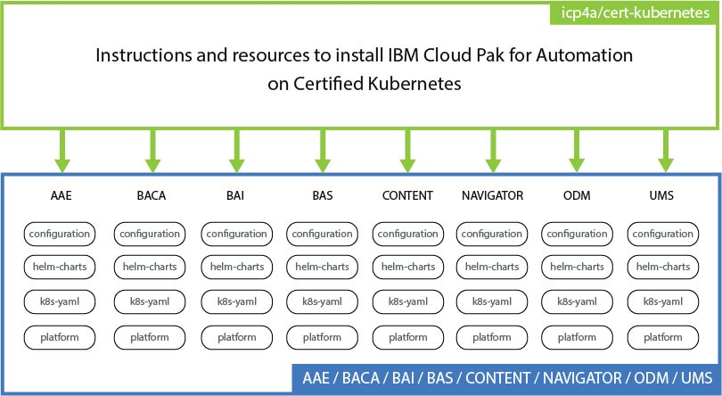

# IBM Cloud Pak for Automation 19.0.1 on Certified Kubernetes

## Introduction

For information about IBM Cloud Pak for Automation 19.0.x, see [IBM Knowledge Center](https://www.ibm.com/support/knowledgecenter/SSYHZ8_19.0.x/welcome/kc_welcome_dba_distrib.html).

The installation of IBM Cloud Pak for Automation products uses Helm charts and Tiller or Kubernetes YAML files. The charts are packages of preconfigured Kubernetes resources that bootstrap a deployment on a Kubernetes cluster. You customize the deployment by changing and adding configuration parameters.

The repository includes one folder for each product.

| Folder 	| Product name 	| Version in 19.0.1 |
|------------	|----------------------------------	|------------- |
| BACA 	| IBM Business Automation Content Analyzer | 19.0.1 |
| BAI 	| IBM Business Automation Insights | 19.0.1 |
| CONTENT 	| IBM FileNet Content Manager | 5.5.3 |
| NAVIGATOR 	| IBM Digital Business Navigator | 3.0.6 |
| ODM 	| IBM Operational Decision Manager | 8.10.2 |

Each product folder contains subfolders, which contain instructions and resources to install the Helm charts. The following diagram shows the structure of the repository.



Installation is supported only on a Certified Kubernetes platform. There are dozens of Certified Kubernetes offerings and more coming to market each year. Cloud Native Computing Foundation (CNCF) has created a Certified Kubernetes Conformance Program, in which most of the leading vendors and cloud computing providers have Certified Kubernetes offerings. Use the following link to determine whether the vendor and/or platform is certified by CNCF https://landscape.cncf.io/category=platform. For more information about nonqualified platforms, see the [support statement for Certified Kubernetes](http://www.ibm.com/support/docview.wss?uid=ibm10876926).

> **Note**: Use the instructions in the IBM Knowledge Center to help you install the containers on IBM Cloud Private. For more information, see [Installing products on IBM Cloud Private](https://www.ibm.com/support/knowledgecenter/SSYHZ8_19.0.x/com.ibm.dba.install/topics/tsk_install_icp.html).

## Legal Notice

Legal notice for users of this repository [legal-notice.md](legal-notice.md).

## Step 1: Prepare your environment

Before you install any of the containerized products:

1. Go to the prerequisites page in the [IBM Cloud Pak for Automation 19.0.x](https://www.ibm.com/support/knowledgecenter/SSYHZ8_19.0.x/com.ibm.dba.install/k8s_topics/tsk_prepare_env_k8s.html) Knowledge Center.
2. Follow the instructions on preparing your environment for the products as explained in the Knowledge Center.

   How much preparation you need to do depends on your environment and how familiar you are with your environment.

##  Step 2: Download a product package from PPA and load the images

[IBM Passport Advantage (PPA)](https://www-01.ibm.com/software/passportadvantage/pao_customer.html) provides a separate archive (.tgz) for each product. To view the list of Passport Advantage eAssembly installation images, refer to the [19.0.1 download document](http://www.ibm.com/support/docview.wss?uid=ibm10878709).

1. Download one or more PPA packages to a server that is connected to your Docker registry.
2. Download the [`loadimages.sh`](scripts/loadimages.sh) script from GitHub.
3. Login to the specified Docker registry with the docker login command.
   This command depends on the environment that you have.    
   > **Note**: If your platform is OpenShift, do NOT run the .sh script to load the images without preparing your environment beforehand. Select the product that you want to install in Step 3 and use the instructions in the product folders. You can then load the images to the Docker registry with the right privileges.
4. Run the `loadimages.sh` script to load the images into your Docker registry. Specify the two mandatory parameters in the command line.

   > **Note**: The *docker-registry* value depends on the platform that you are using.

   ```
   -p  PPA archive files location or archive filename
   -r  Target Docker registry and namespace
   -l  Optional: Target a local registry
   ```

   > The following example shows the input values in the command line.

   ```
   # scripts/loadimages.sh -p /Downloads/PPA/ImageArchive.tgz -r <DOCKER-REGISTRY>/demo-project
   ```

## Step 3: Go to a product folder and follow the instructions

You can install the products on a certified Kubernetes platform with the Helm command line interface (CLI) or the kubectl command line interface (CLI). Use the following links to go to the instructions for the product that you want to install.

- [Install IBM Business Automation Content Analyzer](BACA/README.md)
- [Install IBM Business Automation Insights](BAI/README.md)
- [Install IBM FileNet Content Manager](CONTENT/README.md)
- [Install IBM Digital Business Navigator](NAVIGATOR/README.md)
- [Install IBM Operational Decision Manager](ODM/README.md)
