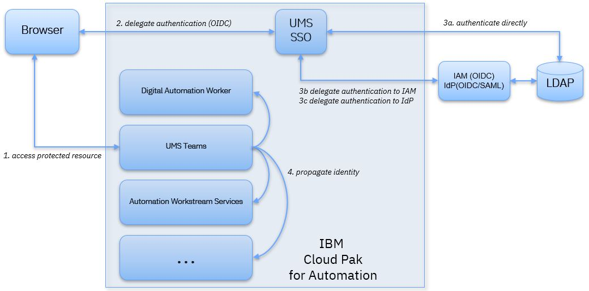

# Configuring User Management Service 20.0.1

## <a name="planning-ums-installation"></a> Planning UMS installation

| Environment size | CPU Minimum (m) | Memory Minimum (Mi) | recommended number of pods |
| ---------- | ----------- | ------------------- | -------------------------- |
| Small      | 500         | 512                 | 2                          |
| Medium     | 1000        | 1024                | 2                          |
| Large      | 2000        | 2048                | 3                          |


## Prerequisites

Make sure that you specified the configuration parameter `sc_deployment_platform` in `shared_configuration`.
If you deploy on Red Hat OpenShift, specify

```yaml
spec:
 shared_configuration:
   sc_deployment_platform: OCP
```

otherwise specify

```yaml
spec:
 shared_configuration:
   sc_deployment_platform: NonOCP
```

## <a name="Step-1"></a> Step 1: Generate the UMS secret

To avoid passing sensitive information in configuration files, you must create a secret manually before you deploy UMS.
Copy the following as ums-secret.yaml, then edit it to specify the required user identifiers and passwords.

**Note:** The sample below includes sample values for passwords. For `ibm-dba-ums-secret` choose passwords that reflect your security requirements.

```yaml
apiVersion: v1
kind: Secret
metadata:
  name: ibm-dba-ums-secret
type: Opaque
stringData:
  adminUser: "umsadmin"
  adminPassword: "password"
  oauthDBUser: "oauthDBUser"
  oauthDBPassword: "oauthDBPassword"
  tsDBUser: "tsDBUser"
  tsDBPassword: "tsDBPassword"
```


| Parameter                          | Description                                     |
| -------------------------------    | ---------------------------------------------   |
| `adminUser`                        | User ID of the UMS admin user to create         |
| `adminPassword`                    | Password for the UMS admin user                 |
| `oauthDBUser`                      | User ID for the OAuth database                  |
| `oauthDBPassword`                  | Password for the OAuth database                 |
| `tsDBUser`                         | User ID for the TeamServer database             |
| `tsDBPassword`                     | Password for the TeamServer database            |

Only specify the database settings if you are not using the internal derby database. 
**Note:** Derby can only be used for test scenarios where persistence and failover are not required. It will not work in scenarios with more than one UMS pod. Data is lost when the pod is restarted.

Apart from the database values that relate to your specific database setup, you can choose all secret values freely.

After modifying the values, save ums-secret.yaml and create the secrets by running the following command

```bash
oc create -f ums-secret.yaml
```

**Note:** `ibm-dba-ums-secret` is passed to the Operator by specifying the `ums_configuration.admin_secret_name` property, as described in section [Configure UMS](#Step-4) 


## Step 2: Configure the UMS datasource

Follow instructions in [Configure Db2 as the UMS datasource](README_config_db2.md) to configure Db2.

Follow instructions in [Configure Oracle as the UMS datasource](README_config_oracle.md) to configure Oracle.

## <a name="Step-3"></a> Step 3: Configure LDAP

In section `ldap_configuration`, adapt the LDAP configuration parameter values to match your LDAP.

For information about LDAP configuration parameters and sample values refer to 
[Configuring the LDAP and user registry](https://www.ibm.com/support/knowledgecenter/SSYHZ8_20.0.x/com.ibm.dba.ref/k8s_topics/ref_k8s_ldap.html).

## <a name="Step-3a"></a> Step 3a (optional): Configure LDAP over SSL

Follow instructions in [Configure LDAP over SSL](README_config_ldap_ssl.md).


## <a name="Step-4">Step 4: Configure UMS
In section `ums_configuration` adapt the UMS-specific configuration

```yaml
ums_configuration:
  existing_claim_name:
  replica_count: 2
  service_type: Route
  hostname: <ums-host>
  port: 443
  images:
    ums:
      repository: cp.icr.io/cp/cp4a/ums/ums
      tag: 20.0.1
  admin_secret_name: ibm-dba-ums-secret
  # optional for secure communication with UMS
  external_tls_secret_name: ibm-dba-ums-external-tls-secret
  # optional for secure communication with UMS 
  external_tls_ca_secret_name: ibm-dba-ums-external-tls-ca-secret
  # optional for secure communication with UMS 
  external_tls_teams_secret_name: ibm-dba-ums-external-tls-teams-secret
  # optional for secure communication with UMS 
  external_tls_scim_secret_name: ibm-dba-ums-external-tls-scim-secret
  # optional for secure communication with UMS 
  external_tls_sso_secret_name: ibm-dba-ums-external-tls-sso-secret
  oauth:
    # optional: full DN of an LDAP group that is authorized to manage OIDC clients, in addition to primary admin from admin secret
    client_manager_group:
    # optional: full DN of an LDAP group that is authorized to manage app_tokens, in addition to primary admin from admin secret
    token_manager_group:
    # optional: lifetime of OAuth access_tokens. default is 7200s
    access_token_lifetime:
    # optional: lifetime of app-tokens. default is 366d
    app_token_lifetime:
    # optional: lifetime of app-passwords. default is 366d
    app_password_lifetime:
    # optional: maximimum number of app-tokens or app-passwords per client. default is 100
    app_token_or_password_limit:
    # optional: encoding / encryption when sotring client secrets in OAuth database. Default is xor for compatibility. Recommended value is PBKDF2WithHmacSHA512
    client_secret_encoding:
  resources:
    limits:
      cpu: 500m
      memory: 512Mi
    requests:
      cpu: 200m
      memory: 256Mi
  ## Horizontal Pod Autoscaler
  autoscaling:
    enabled: true
    min_replicas: 2
    max_replicas: 5
    target_average_utilization: 98
  use_custom_jdbc_drivers: false
  use_custom_binaries: false
  custom_secret_name:
  custom_xml:
  logs:
    console_format: json
    console_log_level: INFO
    console_source: message,trace,accessLog,ffdc,audit
    trace_format: ENHANCED
    trace_specification: "*=info"
```

For information about UMS configuration parameters and their default values, see 
[UMS Configuration Parameters](https://www.ibm.com/support/knowledgecenter/SSYHZ8_20.0.x/com.ibm.dba.ref/k8s_topics/ref_ums_params_ums.html) 

**Note:** Either `ums_configuration.hostname` or `shared_configuration.sc_deployment_hostname_suffix` must be configured. To avoid definining explicit hostnames for different roles, the recommendation is to configure `shared_configuration.sc_deployment_hostname_suffix` and leave `ums_configuration.hostname` blank. In this case, `ums_configuration.hostname` will be generated from `shared_configuration.sc_deployment_hostname_suffix`.

**Note:** There are several options for the `external_tls_secret_name`, `external_tls_ca_secret_name`, `external_tls_sso_secret_name` `external_tls_teams_secret_name`, `external_tls_scim_secret_name`:
* Option 1: Do not create the secret and remove the property from the Custom Resource. In this case, the secret will be generated. 
If you do not create the secret and do not remove the property from the Custom Resource, an error will be reported during deployment.
* Option 2: Create the secret and specify the name of the secret in the Custom Resource. In this case, the secret that you provide will be used.


## <a name="Step-5a"></a> Step 5a (optional): Configure secure communication with UMS 

See [Configuring secure communication with UMS](README_config_SSL.md).


## <a name="Step-6"></a> Step 6 (optional): Configure UMS to delegate authentication to an IdP

The User Management Service (UMS) provides single sign-on for Cloud Pak for Automation components.
The single sign-on is based on OpenID Connect (OIDC). UMS can also be configured to delegate authentication to a third-party Identity Provider (IdP).

The following figure summarizes the authentication flows that are supported by UMS:
1. A browser attempts to access any of the IBM Cloud Pak for Automation components.
1. Depending on the OpenID Connect (OIDC) configuration, there is a redirect to UMS.
1. Depending on the UMS configuration, one of the following takes place:
  - a. UMS authenticates the user against LDAP 
  - b. UMS delegates authentication to IAM (OIDC) provided by IBM Common Services
  - c. UMS delegates authentication to an IdP (OIDC or SAML) 
4. Upon completing the OIDC flow, the platform component has a session with the browser and the necessary tokens that allow invoking other platform components.



To connect UMS to your preferred Identity Provider, follow the corresponding instructions:
* [Configure UMS to delegate authentication to IAM provided by IBM Common Services](README_config_IAM.md)
* [Configure UMS to delegate authentication to an OIDC Identity Provider](README_config_OIDC.md)

## Step 7: Complete the installation

Return to the appropriate install or update page to configure other components and complete the deployment with the operator.

Install pages:
   - [Managed OpenShift installation page](../platform/roks/install.md)
   - [OpenShift installation page](../platform/ocp/install.md)
   - [Certified Kubernetes installation page](../platform/k8s/install.md)

Update pages:
   - [Managed OpenShift installation page](../platform/roks/update.md)
   - [OpenShift installation page](../platform/ocp/update.md)
   - [Certified Kubernetes installation page](../platform/k8s/update.md)
