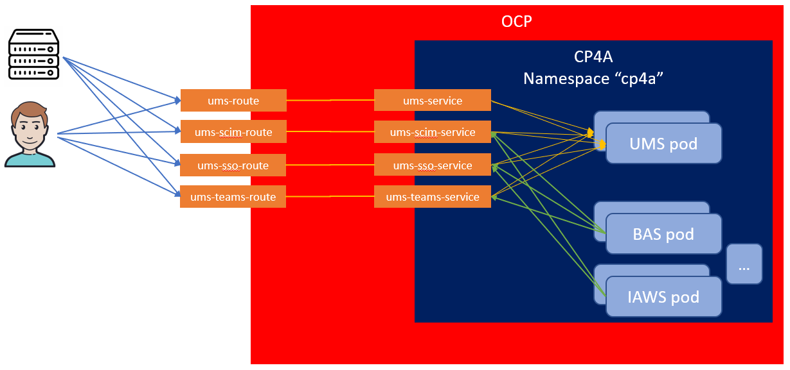

# Configuring secure communications with UMS
To reach UMS from outside of the kubernetes cluster, the client (for example, a browser or a programmatic client) connects to `ums-route`, `ums-sso-route`, `ums-scim-route` or `ums-teams-route` that are created during UMS deployment. There are dedicated routes for each of the features that UMS provides to help separate network traffic.
Each route in turn, communicates with its respective service: `ums-service`, `ums-sso-service`, `ums-scim-service` and `ums-teams-service` that load balances between UMS pods.



In this diagram BAS (Studio) and IAWS (Workstreams) are sample clients of UMS that invoke one or more UMS features by calling k8s services with generated certificates that are signed by a generated root certificate authority. External clients like browsers or programmatic clients connect to one or more of the routes, which you can optionally configure using your own certificates.

To ensure that sensitive information is protected in transit when communicating with UMS pods, routes only accept encrypted requests and communicate over encrypted channels with their respective services by default. Consequently TLS certificates are required for each of the routes and each of the services. This documentation describes the different options and provides instructions on how to configure secure communications with UMS pods.

**Note:** Communication is secured by using TLS certificates. To simplify the overall configuration, you can leave it up to the operator to generate TLS certificates and secrets. All UMS-related generated certificates are automatically updated before they expire.

## Option 1 - No external certificate

In a test environment, you might only want to test features and functions and might not want to deal with certificates.
In this case, do not create `external_tls_secret_name`, `external_tls_ca_secret_name`, `external_tls_teams_secret`, `external_tls_sso_secret`, `external_tls_scim_secret` and remove these parameters from the Custom Resource.

By using this configuration option, `root_ca_secret` is  used to generate an internal TLS secret for all services and an external TLS secret for each of the routes `ums-route`, `ums-sso-route`, `ums-scim-route`, `ums-teams-route`.
 
| Custom Resource parameter                     |        Origin     |
| --------------------------------------------- | ------------------|
| `shared_configuration.root_ca_secret`         | Not configured. Secret will be created by operator with a generated signer certificate |
| `ums_configuration.external_tls_secret_name`  | Not configured. Secret will be created by operator with a generated certificate signed by the signer in `shared_configuration.root_ca_secret` |
| `ums_configuration.external_tls_scim_secret_name`  | Not configured. Secret will be created by operator with a generated certificate signed by the signer in `shared_configuration.root_ca_secret` |
| `ums_configuration.external_tls_sso_secret_name`  | Not configured. Secret will be created by operator with a generated certificate signed by the signer in `shared_configuration.root_ca_secret` |
| `ums_configuration.external_tls_teams_secret_name`  | Not configured. Secret will be created by operator with a generated certificate signed by the signer in `shared_configuration.root_ca_secret` |
| `ums_configuration.external_tls_ca_secret_name`  | Not configured. There are no intermediary certificates required to complete the certificate chain |
 
**Note:**  If you do not provide a [root] signing CA in the `shared_configuration` section of the Custom Resource, `root_ca_secret` is generated by the operator with a self-signed root CA.

## Option 2 - Customer-provided external certificate

In a production environment, communications are secured by using a TLS certificate that represents the hostnames of the routes that your clients connect to. You can provide an external certificate that is signed by an external certificate authority (CA) that is trusted by your clients.

**Note:** You can also generate a certificate using openssl, see section [Creating TLS certificates using openssl](#Creating-TLS-certificates-using-openssl)

Generate a secret (`ibm-dba-ums-external-tls-secret`) to include the key and the external certificate.
```
oc create secret tls ibm-dba-ums-external-tls-secret --key=tls.key --cert=tls.crt
```

Repeat this step to generate `ibm-dba-ums-external-tls-sso-secret`, `ibm-dba-ums-external-tls-scim-secret`, `ibm-dba-ums-external-tls-teams-secret`.

Generate a secret (`ibm-dba-ums-external-tls-ca-secret`) to include any number of signer certificates that are necessary to trust the external certificate. 
This can be required if your external certificate was cross-signed by a second certificate authority or if the tls.crt file does not include ALL certificates of 
its certification chain.
```
oc create secret generic ibm-dba-ums-external-tls-ca-secret --from-file=cacert.crt=</path/to/file>
```


Provide secrets to the operator in the `ums_configuration` section of the Custom Resource:
```yaml
ums_configuration:
  ...
  external_tls_secret_name: ibm-dba-ums-external-tls-secret
  external_tls_ca_secret_name: ibm-dba-ums-external-tls-ca-secret
  external_tls_teams_secret_name: ibm-dba-ums-external-tls-teams-secret
  external_tls_scim_secret_name: ibm-dba-ums-external-tls-scim-secret
  external_tls_sso_secret_name: ibm-dba-ums-external-tls-sso-secret
```

**Note:** If the signer certificate is chained in the external certificate, `ibm-dba-ums-external-tls-ca-secret` is not required, and you should leave this parameter empty:
```yaml
ums_configuration:
  ...
  external_tls_secret_name: ibm-dba-ums-external-tls-secret
  external_tls_ca_secret_name: 
```

By using this configuration option, the customer-provided external certificate is used as the ums-route, ums-sso-route, ums-scim-route, ums-teams-route certificate.
The operator generates a certificate for the UMS pod that is signed with the `root_ca_secret`.
Signer certificates are configured for the `ums-route`, `ums-sso-route`, `ums-scim-route`, `ums-teams-route`, so that clients can trust these routes.

| Custom Resource parameter                     |        Origin     |
| --------------------------------------------- | ------------------|
| `shared_configuration.root_ca_secret`         | Not configured. Secret will be created by operator with a generated signer certificate. If you have a custom signer certificate that should be used to sign certificates for k8s services and routes, you can create a secret and provide its name here. |
| `ums_configuration.external_tls_secret_name`  | Customer provided certificate in TLS secret |
| `ums_configuration.external_tls_scim_secret_name`  | Customer provided certificate in TLS secret. It can be the same as external_tls_secret_name, if valid for all hostnames. |
| `ums_configuration.external_tls_sso_secret_name`  | Customer provided certificate in TLS secret. It can be the same as external_tls_secret_name, if valid for all hostnames. |
| `ums_configuration.external_tls_teams_secret_name`  | Customer provided certificate in TLS secret. It can be the same as external_tls_secret_name, if valid for all hostnames. |
| `ums_configuration.external_tls_ca_secret_name`  | Rarely required. Any intermediary certificates to complete the certificate chain |

### Creating TLS certificates using openssl

You can create a TLS certificate signing request by executing OpenSSL. Note that the final certificate should have a `Subject Alternative Names` (SAN) value that matches the hostname. Many certificate authorities allow you to specify SANs during the ordering process, otherwise you must provide the SAN directly in the certificate signing request (CSR).
```
openssl req -new -newkey rsa:2048 -subj "/CN=UMS" -extensions SAN  -days 365 -nodes -out ums.csr -config <(cat /etc/ssl/openssl.cnf <(printf "[SAN]\nsubjectAltName=DNS:ums.mycluster.com"))
```

Two files are generated: a private key (privkey.pem) and a certificate signing request that can be sent to your certificate authority for sigining.
Use the private key and your certificate authority's response to generate the secrets `ibm-dba-ums-external-tls-secret`, `ibm-dba-ums-external-tls-teams-secret`, `ibm-dba-ums-external-tls-scim-secret`, `ibm-dba-ums-external-tls-sso-secret`.
If the response from your certificate authority does not include all certificates from its signing chain, you can provide them in `ibm-dba-ums-external-tls-ca-secret`

## Continue with the UMS configuration

Continue with the UMS configuration: [README_config.md](README_config.md)
