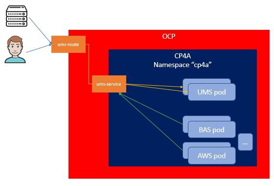
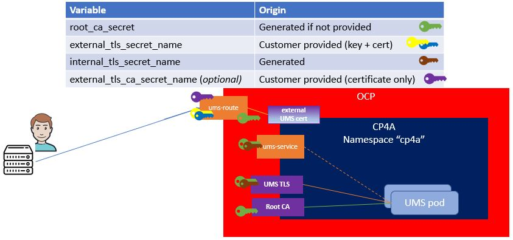

# Configuring secure communications with UMS
To reach UMS from outside of the kubernetes cluster, 
the client (e.g. a browser or a programmatic client) connects to ums-route that is created during UMS deployment.
ums-route, in turn, communicates with the ums-service that load balances between UMS pods.



To ensure that sensitive information is protected in transit when communicating with UMS pods, you must setup secure communications.
This documentation describes the different options and provides instructions on how to configure a secure communication with UMS pods.

## Option 1 - Without an external certificate

In a test environment, you might only want to test features and functions and might not want to deal with certificates.
In this case, do not specify values for `external_tls_secret_name` and `external_tls_ca_secret_name` in the Custom Resource YAML file (or just omit these parameters):

```yaml
ums_configuration:
  ...
  external_tls_secret_name: 
  external_tls_ca_secret_name: 
```

By using this configuration option, `root_ca_secret` is  used to generate an internal TLS secret
 for the pod and an external TLS secret for the ums-route.
 
 
 
**Note:**  If you do not provide a self-signed root CA in the `shared_configuraiton` section of the Custom Resource YAML file, `root_ca_secret` is automatically generated by the Operator with a self-signed root CA.


## Option 2 - Customer-provided external certificate

In a production environment, communications are secured by using a TLS certificate. 
In this case, you must provide an external certificate that is signed by an external certificate authority (CA) that is trusted by your clients.

**Note:** You can also generate a certificate using openssl, see section [Creating TLS certificates using openssl](#Creating-TLS-certificates-using-openssl)

Generate a secret (`ibm-dba-ums-external-tls-secret`) to include the key and the external certificate.
```
oc create secret tls ibm-dba-ums-external-tls-secret --key=tls.key --cert=tls.crt
```

Generate a secret (`ibm-dba-ums-external-tls-ca-secret`) to include any number of signer certificates that are necessary to trust the external certificate. 
This can be required if your external certificate was cross-signed by a second certificate authority or if the tls.crt file does not include ALL certificates of 
its certification chain.
```
oc create secret generic ibm-dba-ums-external-tls-ca-secret --from-file=cacert.crt=</path/to/file>
```

Provide both secrets to the Operator in the `ums_configuration` section of the Custom Resource YAML file:
```yaml
ums_configuration:
  ...
  external_tls_secret_name: ibm-dba-ums-external-tls-secret
  external_tls_ca_secret_name: ibm-dba-ums-external-tls-ca-secret
```

**Note:** If the signer certificate is chained in the external certificate, `ibm-dba-ums-external-tls-ca-secret` is not required, and you should leave this parameter empty:
```yaml
ums_configuration:
  ...
  external_tls_secret_name: ibm-dba-ums-external-tls-secret
  external_tls_ca_secret_name: 
```

By using this configuration option, the customer-provided external certificate is used as the ums-route certificate.
The Operator generates a certificate for the UMS pod, signed with the `root_ca_secret`.
Signer certificates are configured for the `ums-route`, so that clients can trust the `ums-route`.

 

### Creating TLS certificates using openssl

You can create a TLS certificate signing request by executing OpenSSL. Note that the final certificate should have a `Subject Alternative Names` (SAN) value that matches the hostname. Many certificate authorities allow you to specify SANs during the ordering process, otherwise you must provide the SAN directly in the certificate signing request (CSR).
```
openssl req -new -newkey rsa:2048 -subj "/CN=UMS" -extensions SAN  -days 365 -nodes -out ums.csr -config <(cat /etc/ssl/openssl.cnf <(printf "[SAN]\nsubjectAltName=DNS:ums.mycluster.com"))
```

Two files are generated: a private key (privkey.pem) and a certificate signing request that can be sent to your certificate authority for sigining.
Use the private key and your certificate authority's response to generate the secret `ibm-dba-ums-external-tls-secret`.
If the response from your certificate authority does not include all certificates from its signing chain, you can provide them in `ibm-dba-ums-external-tls-ca-secret`

## Continue with the UMS configuration

Continue with the UMS configuration: [README_config.md](README_config.md)
